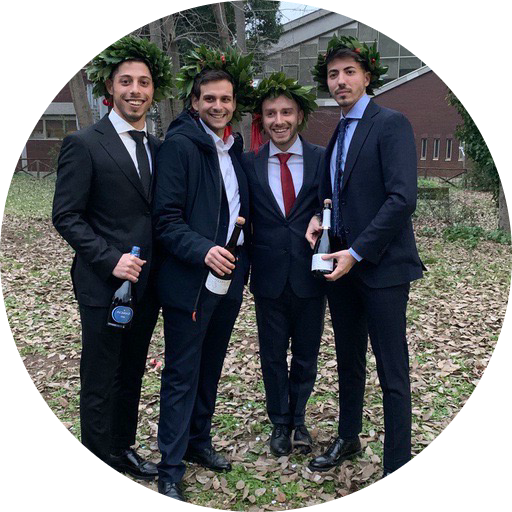

# Computer Scientists Retrieval
Web Information Retrieval Project 

## Table of Contents

- [Getting Started](#Getting-Started)
- [Built With](#Built-With)
- [Repository Content](#Built-With)
- [Running Programs](#Running-Programs)
- [Authors](#Authors)


## Getting Started

WIR project for 2020 course at MSC in Engineering in Computer Science, Sapienza University, Rome. 
The goal of the project is to rank computer scientists based on their influence using Google's PageRank and HITS algorithm and to classify computer scientists categories.


## Built With

* [SPARQLWrapper](https://pypi.org/project/SPARQLWrapper/)
* [bs4 Beautiful Soup](https://www.crummy.com/software/BeautifulSoup/bs4/doc/)
* [urllib](https://docs.python.org/3/library/urllib.html)
* [requests](https://requests.readthedocs.io/en/master/)
* [re](https://docs.python.org/3/library/re.html)
* [NetworkX](https://networkx.github.io)
* [Matplotlib](https://matplotlib.org/users/pyplot/tutorial.html)
* [Sortedcontainers](http://www.grantjenks.com/docs/sortedcontainers/)
* [Collections](https://docs.python.org/3/library/collections.html)
* [Glob](https://docs.python.org/2/library/glob.html)
* [Tarfile](https://docs.python.org/3/library/tarfile.html)


## Repository Content

```
.
├── README.md
└── Report
│     ├── tex_files
│     └── Computer_Scientist_Retrieval.pptx
│
└── files
│   ├── categorization.json
│   ├── dbpedia_data.json
│   ├── good_name_links.json
│   ├── hits_top_20_categories.txt
│   ├── my_graph.pdf
│   ├── my_pagerank_top20.txt
│   ├── name_links.json
│   └── pagerank_top_20_categories.txt 
│
└── src
    ├── DBpedia
    ├── First_Phase
    ├── Second_Phase
    ├── Third_Phase
    ├── Fourth_Phase  
    └── requirements.txt
```

## Running Programs

```console
lucasmac@author:~$ cd src
DBpedia    First_Phase    Fourth_Phase    Second_Phase    Third_Phase    requirements.txt
```

```console
lucasmac@author:~$ pip install -r requirements.txt
```

Now you can run any python file you find in one of the 5 folders.

## Authors


 

| |[](https://lucatomei.github.io)</br>Linkedin | [](https://lucatomei.github.io)</br>Github | [](https://lucatomei.github.io)</br>Twitter | [](https://lucatomei.github.io)</br>Telegram | [](https://lucatomei.github.io)</br>WebPage |
| :---------: | :---------: | :---------: | :---------: | :---------: | :---------: |
|Luca Tomei| <p align="center">[✅](https://www.linkedin.com/in/luca-tomei-760296ab/)</p>| <p align="center">[✅](https://github.com/LucaTomei/)</p>| <p align="center">[✅](https://twitter.com/LucaTomei1995)</p>| <p align="center">[✅](https://twitter.com/LucaTomei1995)</p>| <p align="center">[✅](https://lucatomei.github.io)</p>|
|Andrea Aurizi| <p align="center">[✅](https://www.linkedin.com/in/andrea-aurizi-66a1351a6/)</p>|  <p align="center">[✅](https://www.linkedin.com/in/andrea-aurizi-66a1351a6/)</p>|  <p align="center">[✅](https://www.linkedin.com/in/andrea-aurizi-66a1351a6/)</p>|  <p align="center">[✅](https://www.linkedin.com/in/andrea-aurizi-66a1351a6/)</p>|  <p align="center">[⬜️]()</p>| 
|Daniele Iacomini| <p align="center">[✅](https://www.linkedin.com/in/daniele-iacomini-12a93819a/)</p>| <p align="center">[✅](https://www.linkedin.com/in/daniele-iacomini-12a93819a/)</p>| <p align="center">[✅](https://www.linkedin.com/in/daniele-iacomini-12a93819a/)</p>| <p align="center">[✅](https://www.linkedin.com/in/daniele-iacomini-12a93819a/)</p>| <p align="center">[⬜️]()</p>| 


